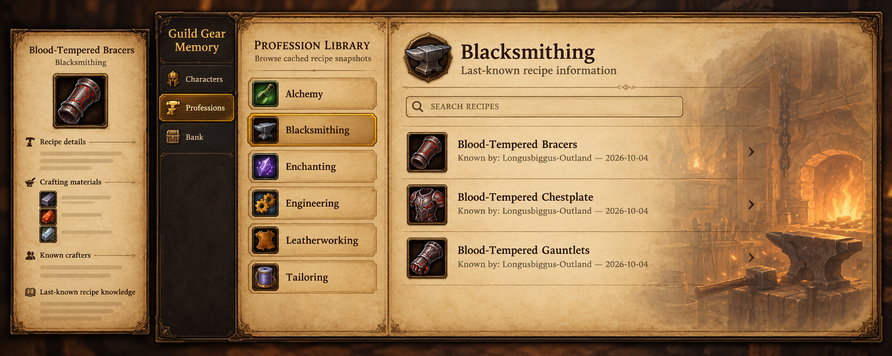
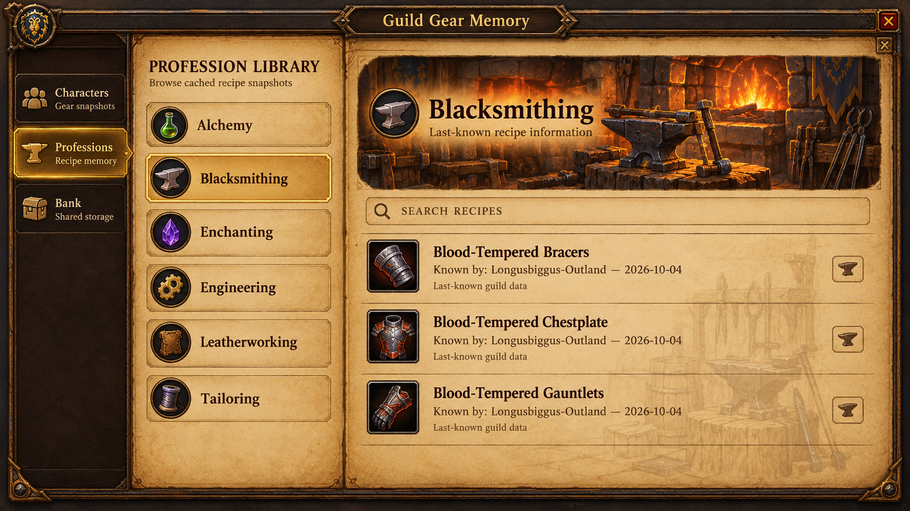
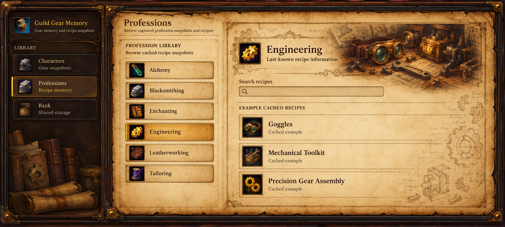

# Profession UI concepts

Created on 2026-10-04 in the `UI-FIX` branch workspace using three `gpt-6-luna` subagents with `max` reasoning effort and the built-in ImageGen tool.

These are visual mockups for choosing a direction. They do not change the running addon. Illustrated icons and example content are concept art, not production assets or newly acquired game data.

All three use the supplied quest-window palette: warm aged parchment, honey tan, dark brown text, leather framing, and slightly darker inset profession buttons. Artwork illustrates the selected profession while preserving readable recipe content and explicit last-known/cached information.

| Example | Direction | Artwork |
| --- | --- | --- |
| [1. Quest Parchment](01-quest-parchment.png) | Parchment panels with a detached recipe details window | Faded Blacksmithing forge behind the recipes |
| [2. Forge Ledger](02-forge-ledger.png) | Illustrated banner with plain parchment recipe rows | Anvil, hammer, tongs, and forge; faint workshop watermark |
| [3. Artisan Journal](03-artisan-journal.png) | Engineering page with journal-like margins | Goggles, brass gears, workbench, and faint schematics |

The exact final prompts are saved in the matching `*-prompt.txt` files. Each PNG was opened and visually reviewed for palette, button contrast, profession artwork, and legible main labels. Addon runtime tests do not apply to these image-only deliverables.

The selected direction is **3. Artisan Journal**. Its assets are now connected to the addon UI, including all six profession headers, paper surfaces, darker buttons, leather navigation, and recipe details. The addon renders text and icons separately from the artwork. See [the integrated asset set](../GuildGearMemory/Media/ArtisanJournal/README.md). The current Lua 5.1 suite passes 389 tests; an in-game visual check is still needed.

## Reference-matched revision

The v2 runtime UI replaces the native title-bar frame with illustrated journal chrome, restores the reference proportions and serif typography, and uses full-page artwork for all six professions. The complete local installation package is `GuildGearMemory-ArtisanJournal-v2.zip`; the earlier ZIP contains the first integration. `artisan-journal-layout-preview.png` is rendered from actual Lua UI geometry with placeholder native icons. In-game appearance remains to be verified after reload.

